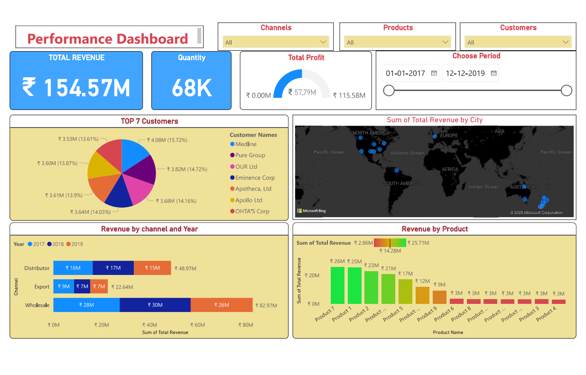

# Sales Performance Dashboard - Power BI

## Overview
This Power BI dashboard analyzes sales performance across products, channels, customers, and cities.

## Key Metrics
- Total Revenue
- Quantity Sold
- Total Profit

## Features
- Revenue by Product
- Revenue by Channel and Year
- Top Customers Analysis
- Geographic Revenue Distribution
- Interactive Filters and Date Selection

## Tools Used
- Power BI
- Data Visualization
- Business Analytics

## Dashboard Preview

## Insights
- Wholesale channel generated highest revenue
- Product 7 showed strongest sales performance
- Revenue concentrated in North America and Australia
